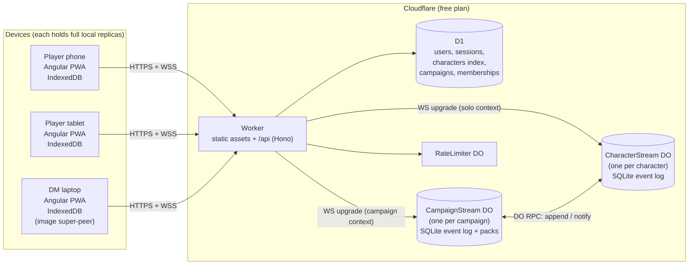

# System overview

## Containers



Images never enter D1 or DO storage; they cross a DO only as in-memory chunks between
two sockets (ADR-010).

**Deployment target B (ADR-014):** the same three server roles — Worker/API, stream
actors, accounts database — run as one Node process on a Windows PC with a static IP
(`ws` sockets, SQLite files, Caddy in front for HTTPS). The backend core is identical;
only the runtime adapters differ (`10-backend-architecture.md`). Devices cannot tell the
targets apart.

## Packages and what runs where

| Package | Runs in | Responsibility |
|---------|---------|----------------|
| `@hk/protocol` | browser, Worker, Node | Zod schemas + types for events, WS messages, pack format, bundles, API DTOs; JSON Schema export |
| `@hk/engine` | browser, Node (tests/tools) | content index, formula parser, effects, predicates, reducer, derive, actions, dice, localizer, search index |
| `@hk/content` | build time | SRD 5.2.1 core pack generated from open5e JSON; icon mapping; sample translation pack |
| `@hk/pack-tools` | Node CLI | validate, build (YAML→JSON), diff, translation extraction |
| `@hk/ui-tokens` | build time | design tokens → SCSS + CSS custom properties |
| `apps/web` | browser | Angular PWA: views, stores, Dexie storage, sync client, blob transfer, i18n, theming |
| `apps/api` | Cloudflare | Hono routes, auth, D1 access, `CharacterStreamDO`, `CampaignStreamDO`, `RateLimiterDO` |

## Contexts (who connects to what)

| Situation | Socket target | Streams subscribed |
|-----------|---------------|--------------------|
| Solo, no account (Phase 1) | none | local only |
| Solo, logged in | `CharacterStream` of the open character | that character |
| Player in campaign | `CampaignStream` | campaign + own character(s) + party overview |
| DM in campaign | `CampaignStream` | campaign + every member character (per visibility, DM sees all) |

The DM's device subscribes to all member character streams through the campaign gateway,
which is why it ends up holding a replica of everything (ADR-003) and every image
(ADR-010).

## Primary data flows

### A player takes damage at the table

```mermaid
sequenceDiagram
  participant DMUI as DM device
  participant CP as CampaignStream DO
  participant CS as CharacterStream DO (Ivan)
  participant PL as Ivan's phone
  DMUI->>DMUI: engine.proposeDamage(sheet, 7) → event (pending, applied locally)
  DMUI->>CP: append {stream: char:ivan, type: dm.damage, …}
  CP->>CP: authorize (actor is DM of this campaign; type allowed)
  CP->>CS: rpc append(event, actor)
  CS->>CS: validate envelope, quota; seq = next; persist
  CS-->>CP: ack {id, seq}
  CP-->>DMUI: ack {id, seq}
  CP-->>PL: event {…, seq}
  PL->>PL: reduce → facts → derive → HP bar animates
```

If Ivan's phone was locked, it receives the event on reconnect via `hello {lastSeq}`.

### A player levels up at home (campaign allows editing outside sessions)

Phone → `CharacterStream` directly (solo context) → persisted → `CharacterStream`
notifies the `CampaignStream` it belongs to → the DM's device (if online) receives the
transaction and the party card updates; otherwise the DM sees it on next connect.

### A new device signs in

Login → `GET /api/me` lists characters and campaigns from D1 → for each stream, open the
socket, `hello {lastSeq: 0}` → full event log streams in pages → local replica built →
image placeholders until peers provide blobs.

### Export

Client packs events + snapshot + pinned packs + referenced blobs into a `.hero` ZIP
(fflate) and hands it to the OS via Web Share / save picker / download.

## Cross-cutting rules

- **Immutability**: events are never edited or deleted server- or client-side.
- **Idempotency**: event ids are client-generated UUIDv7; the DO ignores duplicates and
  re-acks the existing `seq`, so retries are safe.
- **Determinism**: the same events + the same pinned packs produce the same Sheet on every
  device; content cannot reach time, randomness, network or device state.
- **No engine on the server**: DOs validate shape, size, permissions, quota — nothing
  else.
- **Degradation**: every screen works with an empty or partial replica (skeletons,
  placeholders, "pending" markers); no feature hard-requires the socket except join and
  login.

## Non-goals (v1)

WebRTC, server-side snapshots, server-side search, push notifications, analytics.
