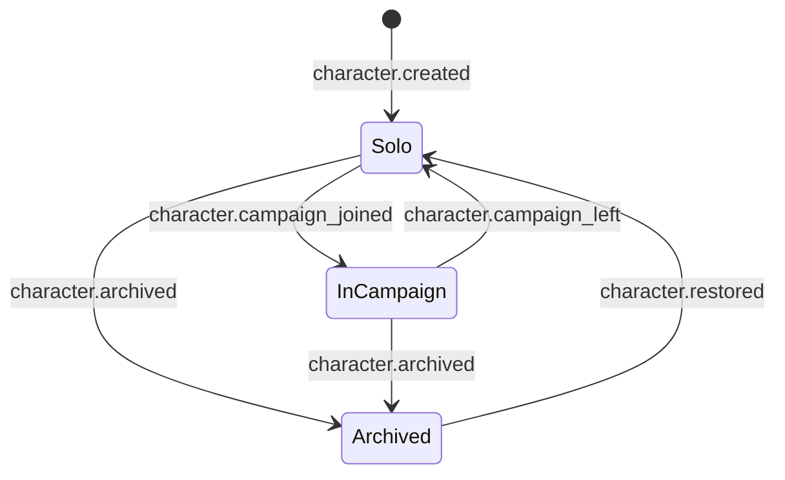

# Domain model and event catalog

All schemas live in `@hk/protocol` as Zod definitions; this document is the human
reference. Event `type` strings are stable public contract; payload changes bump `v`.

## Identifiers

| Thing | Format | Example |
|-------|--------|---------|
| User | `usr_` + 22-char base62 | `usr_3k9…` |
| Character | UUIDv7 | — |
| Campaign | UUIDv7 | — |
| Join code | 8 chars, Crockford base32, no vowels (avoids words) | `7QX4-M2HN` |
| Stream | `char:<characterId>` / `camp:<campaignId>` | — |
| Event | UUIDv7 (client-generated) | — |
| Entity | `<packId>:<type>/<slug>` | `srd-5e-2024:spell/fireball` |
| Choice | `<entityId>@<level>/<choiceSlug>` | `srd-5e-2024:class/fighter@1/fighting-style` |
| Blob | `sha256:<hex>` | — |
| Item instance | UUIDv7 | — |

## Entities (server-side, D1)

```
users(id, username, username_folded UNIQUE, salt, verifier_hash, created_at,
      quota_bytes_used, flags)
sessions(token_hash PK, user_id, device_label, created_at, last_seen_at, expires_at)
recovery_codes(user_id, code_hash, used_at)
characters(id PK, owner_id, name, system, campaign_id NULL, archived_at NULL,
           bytes_used, event_count, updated_at)
campaigns(id PK, dm_id, name, system, join_code UNIQUE, join_open, bytes_used, updated_at)
memberships(campaign_id, user_id, role: 'dm'|'player', display_name, joined_at,
            PRIMARY KEY(campaign_id, user_id))
```

D1 is an *index* (lists, lookups, quotas, auth). Truth for game data is the streams.

## Streams (Durable Object SQLite)

```
events(seq INTEGER PK, id TEXT UNIQUE, type, v, ts, actor_json, tx_id NULL,
       payload_json, bytes)
meta(key PK, value)            -- owner, campaign, pins, bytes_used, subscribers
packs(id, version, json)       -- CampaignStream only: enabled non-core packs
```

## Character facts (client-side, derived by the reducer)

```
Facts {
  id, system, name, grammaticalGender, appearance, portrait?: {hash, thumbHash},
  createdWith: {engineVersion, appVersion},
  pins: {packId → version},
  decisions: {choiceId → selection[]},          // selections are entity ids or literals
  classes: [{classId, level, subclassId?}],      // order = order gained
  xp, levelGrants (milestone),
  hp: {current, temp, max override?}, hitDice: {classId → spent}, deathSaves: {s, f},
  slots: {level → used}, pactSlots?, resources: {resourceId → used},
  conditions: [{conditionId, source, since, until?, level?}],   // exhaustion has level
  concentration?: {spellId, since},
  inventory: [{instanceId, itemId, qty, equipped, attuned, name?, notes?, custom?}],
  currency: {cp, sp, ep, gp, pp},
  inspiration: boolean,
  notes: [{id, title, body, updated}],
  campaignId?, ownerId,
  skipped: [{eventId, reason}],
  lastSeq, appliedPendingIds
}
```

## Event catalog — character stream

Actor column: **O** owner, **D** DM of the character's campaign, **S** system (server-
generated, e.g. quota notices — none in v1).

| Type (v1) | Actor | Payload | Notes |
|-----------|-------|---------|-------|
| `character.created` | O | `{name, system, corePack: {id, version}, engineVersion, grammaticalGender}` | first event; pins the core pack |
| `character.renamed` | O, D(override) | `{name}` | |
| `character.appearance_set` | O | `{age?, height?, weight?, eyes?, hair?, skin?, description?}` | |
| `character.gender_set` | O | `{grammaticalGender}` | text only |
| `character.archived` / `character.restored` | O | `{}` | soft delete |
| `character.owner_transferred` | D, O | `{toUserId}` | claim / hand over |
| `character.campaign_joined` / `character.campaign_left` | O, D | `{campaignId}` | mirrored on campaign stream |
| `pack.pinned` | O, D | `{packId, version, previous?}` | rebase commits this |
| `decision.made` | O | `{choiceId, selection: string[], context?}` | the builder's atom; for ability-score generation `context` holds `{method: standardArray \| pointBuy \| manual \| roll, scores, rolls?: [[d,d,d,d]…]}` so the timeline can show the dice |
| `decision.cleared` | O | `{choiceId}` | rare; used by rebase |
| `level.gained` | O | `{classId, level, hpRoll?: number \| "average", subclassId?}` | inside a `txId` with its decisions |
| `level.granted` | D | `{count?: 1}` | milestone mode |
| `xp.awarded` | D, O(solo) | `{amount, reason?}` | negative allowed for corrections |
| `hp.changed` | O, D | `{delta, kind: damage \| heal \| temp \| set, source?, damageType?}` | reducer clamps to [0, max]; temp HP rules applied |
| `hit_dice.spent` / `hit_dice.regained` | O | `{classId, count, healed?}` | |
| `death_save.recorded` | O, D | `{result: success \| failure \| critSuccess \| critFailure}` | reset by heal/stabilize |
| `stabilized` | O, D | `{}` | |
| `slot.spent` / `slot.restored` | O | `{level, pact?: boolean, count?}` | |
| `resource.spent` / `resource.restored` | O, D | `{resourceId, count?}` | second wind, rage… |
| `spell.prepared` / `spell.unprepared` | O | `{spellId, classId}` | |
| `spell.learned` / `spell.forgotten` | O | `{spellId, classId, source: levelUp \| scroll \| copy}` | spellbook / known |
| `spell.cast` | O | `{spellId, level, slotUsed?: boolean, concentration?: boolean}` | convenience event that folds to slot + concentration |
| `concentration.started` / `concentration.ended` | O, D | `{spellId?}` | |
| `condition.added` / `condition.removed` | O, D | `{conditionId, source?, until?, level?}` | exhaustion uses `level` |
| `item.added` | O, D | `{instanceId, itemId, qty, name?, custom?}` | `custom` = inline homebrew item definition (quick homebrew) |
| `item.removed` | O, D | `{instanceId, qty?}` | |
| `item.equipped` / `item.unequipped` | O | `{instanceId, slot?}` | |
| `item.attuned` / `item.unattuned` | O | `{instanceId}` | max 3 enforced by UI, not reducer |
| `item.updated` | O | `{instanceId, name?, notes?, qty?}` | |
| `currency.changed` | O, D | `{cp?, sp?, ep?, gp?, pp?}` | deltas |
| `rest.taken` | O | `{kind: short \| long, hitDiceSpent?: [...]}` | reducer applies the system's rest rules from the pinned core pack |
| `inspiration.changed` | O, D | `{value: boolean}` | |
| `note.added` / `note.updated` / `note.removed` | O | `{id, title?, body?}` | body ≤ 8 KB |
| `portrait.set` / `portrait.cleared` | O | `{hash, thumbHash, mime, w, h}` | blob announced implicitly |
| `override.applied` | D, O(solo) | `{path, value, reason}` | `path` is a Sheet path (`ac`, `abilities.str.score`, `speed.walk`); rendered distinctly |
| `event.reverted` | O, D | `{targetId?: eventId, txId?: uuid, reason?}` | reducer skips targets |
| `history.compacted` | O | `{throughSeq, facts}` | reserved; not emitted in v1 |

Rules the reducer applies (from the pinned core pack's `system` entity, not code):
temp HP does not stack (keep higher); damage hits temp first; healing from 0 clears death
saves; long rest restores HP, all slots, half hit dice (rounded down, min 1), resets
`longRest` resources, reduces exhaustion by 1; short rest resets `shortRest` resources.

## Event catalog — campaign stream

Actor: **D** DM, **M** member (any role), **S** system.

| Type (v1) | Actor | Payload |
|-----------|-------|---------|
| `campaign.created` | D | `{name, system, corePack: {id, version}}` |
| `campaign.renamed` | D | `{name}` |
| `campaign.settings_changed` | D | `{settings}` (full document, see below) |
| `campaign.join_code_rotated` | D | `{joinCode}` (also updates D1) |
| `campaign.archived` | D | `{}` |
| `pack.enabled` / `pack.disabled` | D | `{packId, version, sha256}` (JSON stored in DO `packs`) |
| `member.joined` / `member.left` / `member.removed` | M / D | `{userId, displayName, role}` |
| `member.renamed` | M | `{displayName}` |
| `campaign.character_joined` / `campaign.character_left` | M, D | `{characterId, ownerId, name}` |
| `party.overview_updated` | M (owner's device) | `{characterId, overview: {hp, hpMax, temp, ac, level, classes, conditions, concentration, portraitThumb, passivePerception}}` — posted by the owner's device on change, throttled |
| `session.started` / `session.ended` | D | `{title?}` — groups the log and timeline |
| `roll.logged` | M | `{characterId?, label, formula, results: [{die, value}], total, kind: check \| attack \| damage \| save \| spell \| custom, visibility: everyone \| dm \| private, manual?: boolean}` |
| `chat.message` | M | `{text ≤ 2 KB, visibility}` (phase 3 optional) |
| `dm.note_added` / `dm.note_updated` / `dm.note_removed` | D | `{id, title?, body?}` — DM-only visibility |

### Campaign settings document

```
{
  system: "5e-2024",
  packs: [{id, version}],                          // enabled content
  houseRules: {
    strictValidation: true,                        // false = warnings only
    allowOverrides: true,
    editOutsideSession: "free" | "dmApproval" | "locked",
    xpMode: "xp" | "milestone",
    hpOnLevelUp: "roll" | "average" | "choice",
    encumbrance: "off" | "standard" | "variant",
    attunementMax: 3,
    startingLevel: 1
  },
  visibility: {
    partySheets: "none" | "overview" | "full",
    rolls: "everyone" | "dm",                      // players may still choose "private"
    allowPrivateRolls: true
  },
  join: { open: true, requireApproval: false }
}
```

## Ownership and lifecycle summary



Pregens: created by the DM inside the campaign (owner = DM); `character.owner_transferred`
on claim. A claimed pregen behaves like any player character.
